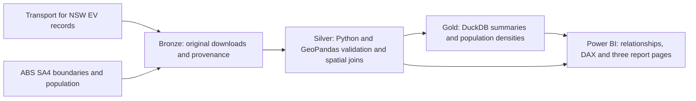

# NSW EV Charging Infrastructure Analytics

A reproducible data engineering and analytics project that combines Transport for NSW charging-location records with ABS geography and population data to compare regional infrastructure coverage.

The analytical unit is a **charging-location record**, not an individual charger or plug. The project separates existing locations from upcoming locations and compares both geographic coverage and the mix of AC/DC infrastructure.

## Data flow



| Layer | Responsibility | Main outputs |
| --- | --- | --- |
| Bronze | Preserve downloads, source URLs, retrieval times and SHA-256 checksums | EV CSV, ABS boundaries, population workbook and geography correspondence |
| Silver | Clean types and operator labels; validate coordinates; assign SA4; validate population geography | EV and SA4 GeoParquet; SA4 population Parquet |
| Gold | Aggregate validated records; reconcile counts; calculate density indicators | SA4, GCC, operator and charger-type Parquet summaries |
| Power BI | Semantic relationships, filter-aware DAX and visualisation | `powerbi/NSW_EV_Dashboard.pbip` |

Python/GeoPandas owns ETL and spatial processing. DuckDB owns analytical aggregation. Power Query imports the existing Parquet outputs without duplicating upstream cleaning.

## Three core findings

These findings use the EV snapshot retrieved on **14 September 2026**, excluding 98 upcoming records. There are **1,860 existing locations**, including **433 DC locations**. They describe the dataset, not a complete census of every NSW charger.

| Finding | Result | Reproducible calculation |
| --- | --- | --- |
| Hunter Valley excluding Newcastle has lower DC coverage per resident | **0.28 DC locations per 10,000 residents**, approximately **56.5% of the NSW rate** | `9 / 316250 * 10000` versus `433 / 8592524 * 10000 = 0.50` |
| The DC mix differs between Sydney and other regions | Greater Sydney **28.0%**; Rest of NSW **18.9%**; gap **9.1 percentage points** | `252 / 901` versus `181 / 959` |
| Existing locations are concentrated among three operator labels | Exploren, Tesla and Chargefox account for **44.0%** | `(301 + 263 + 254) / 1860` |

The third finding uses the current `operator_standardised` grouping. Some possible aliases, including `Evie` and `Evie Networks`, remain separate. This is a share of location records, not revenue or market share. Low DC share alone does not establish unmet demand.

The Hunter region also has a DC share of 7.4% (`9 / 122`), versus 23.3% statewide (`433 / 1860`). These are two different indicators: the mix of charger types and coverage relative to residents.

Run `python -m src.pipeline --from-silver` to rebuild Gold and regenerate [the SQL audit trail](analysis/findings.sql), [raw findings and provenance](analysis/findings.json), and [all SA4 population densities](analysis/sa4_population_density.csv).

## Population-adjusted coverage

Area density answers how geographically spread out infrastructure is. Population density provides a complementary measure of infrastructure relative to residents:

`Existing charging locations per 10,000 residents = existing location count / resident population * 10,000`

The denominator is ABS estimated resident population at **30 June 2025**, originally on ASGS 2021 geography. The official ABS correspondence confirms one-to-one, weight-one mappings for all 28 spatial NSW SA4 regions to SA4 2026; their combined population reconciles to **8,592,524** residents. Source URLs and checksums are recorded with the inputs. Population is not a substitute for EV ownership, traffic, utilisation or visitor demand.

Gold adds `locations_per_10000_residents` (existing locations) and `dc_locations_per_10000_residents` (existing DC locations). Existing Gold count columns continue to include upcoming records. Power BI calculates the population rate as a ratio of summed counts and populations; GCC/SA4 filters affect both sides, while charger/operator filters affect only the numerator.

## Run the project

Use Python 3.13 and run commands from the repository root:

```powershell
python -m venv .venv
.venv\Scripts\Activate.ps1
python -m pip install -r requirements.txt
python -m src.pipeline
python -m pytest -q
```

The full pipeline downloads EV records, ABS boundaries and population inputs, runs the existing cleaning/spatial functions, builds DuckDB Gold tables and exports the analysis evidence. The first run needs internet access, including installation of DuckDB Spatial. Refreshed source data can change the results above.

If validated EV and SA4 Silver files already exist, preserve that snapshot and build the analytical layer with:

```powershell
python -m src.pipeline --from-silver
```

The notebooks `01`–`06` document acquisition, exploration, cleaning, spatial enrichment and DuckDB aggregation. The command-line pipeline is the reproducible entry point.

## Power BI report

Open `powerbi/NSW_EV_Dashboard.pbip` in Power BI Desktop and refresh the model after rebuilding Gold. The three pages cover NSW overview, geographic distribution, and operator/charging infrastructure.

The existing Power Query paths point to `D:\mycode\nsw-ev-data-pipeline\data\...`. A different checkout location requires updating those paths in Desktop. The report uses a filter-aware SA4 chart and station details table instead of Azure Maps, so map tenant permissions are not required.

Dynamic KPIs use measures over `EV_Locations`. Pre-aggregated Gold baseline visuals are labelled with their filtering scope. The analysis findings and population density are documented and bound to model measures in the report.

See [validation results and every modified file](analysis/VALIDATION.md) for the verification record and Desktop checks that remain.

## Sources and limitations

- [Transport for NSW EV Charging Locations](https://opendata.transport.nsw.gov.au/data/dataset/be1c4de4-4517-4bd0-8a09-2965ddfc7179): original data and provenance under `data/bronze/ev/`.
- [ABS ASGS Edition 4 boundaries](https://www.abs.gov.au/statistics/standards/australian-statistical-geography-standard-asgs/edition-4-july-2026-june-2031/access-and-downloads/digital-boundary-files): SA4 2026, GDA2020.
- [ABS Regional population, 2024–25](https://www.abs.gov.au/statistics/people/population/regional-population/2024-25): estimated resident population at 30 June 2025.
- [ABS 2021–2026 correspondences](https://www.abs.gov.au/statistics/standards/australian-statistical-geography-standard-asgs/edition-4-july-2026-june-2031/access-and-downloads/correspondences): used to validate or translate population geography.

The EV snapshot and population reference date differ. DC is the dataset's charger-type classification; location counts are distinct from plug counts and charging capacity. Complex charger ratings and missing power values limit power comparisons. One EV record uses the existing conservative nearest-boundary fallback; assignment method and distance remain available for audit.

Generated raw data, Parquet outputs, DuckDB databases and Power BI caches are ignored by Git. Source code, tests, SQL, analysis evidence and PBIP/TMDL/PBIR definitions remain reviewable. No data is automatically published or committed.
